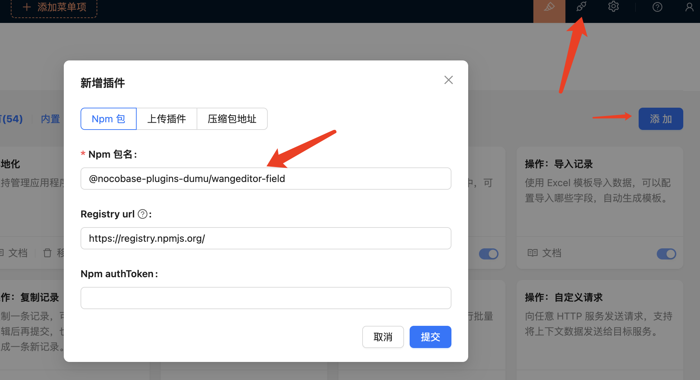
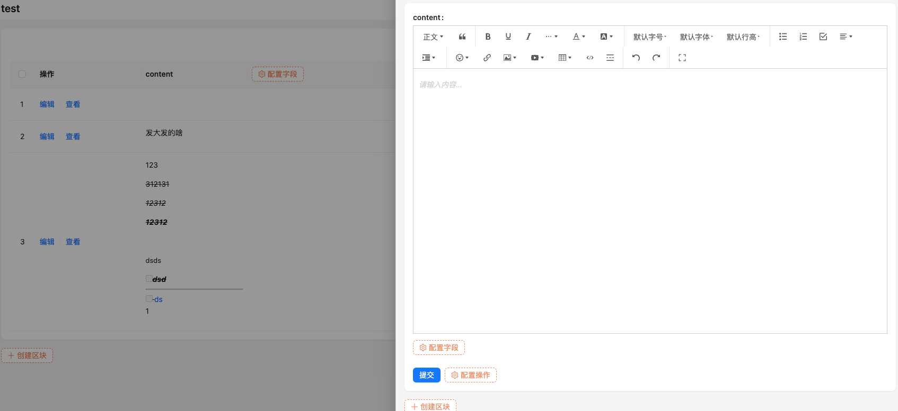
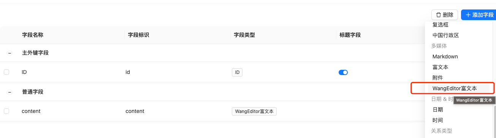
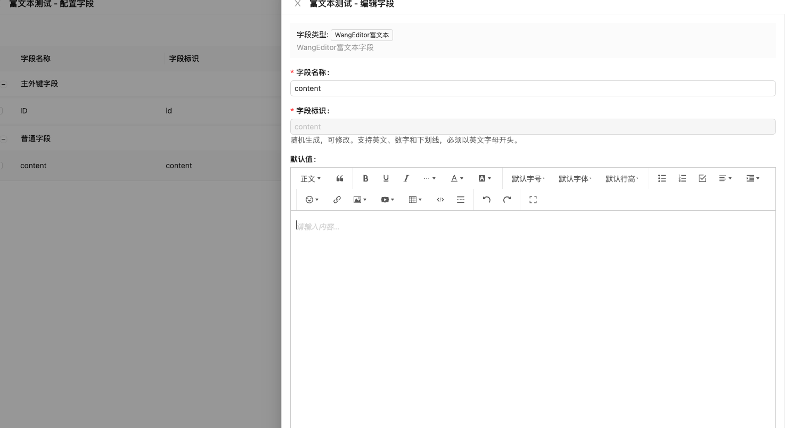

# Nocobase wangeditor 富文本字段插件

### 在线安装
输入 `@nocobase-plugins-dumu/wangeditor-field` 包名


### 代码安装

``` shell
cd packages/plugins
mkdir @nocobase-plugins-dumu
cd @nocobase-plugins-dumu
git clone git@github.com:nocobase-plugins-dumu/wangeditor-field.git
yarn
yarn pm add @nocobase-plugins-dumu/wangeditor-field
yarn pm enable @nocobase-plugins-dumu/wangeditor-field (可不执行，在插件管理中开启)
```




